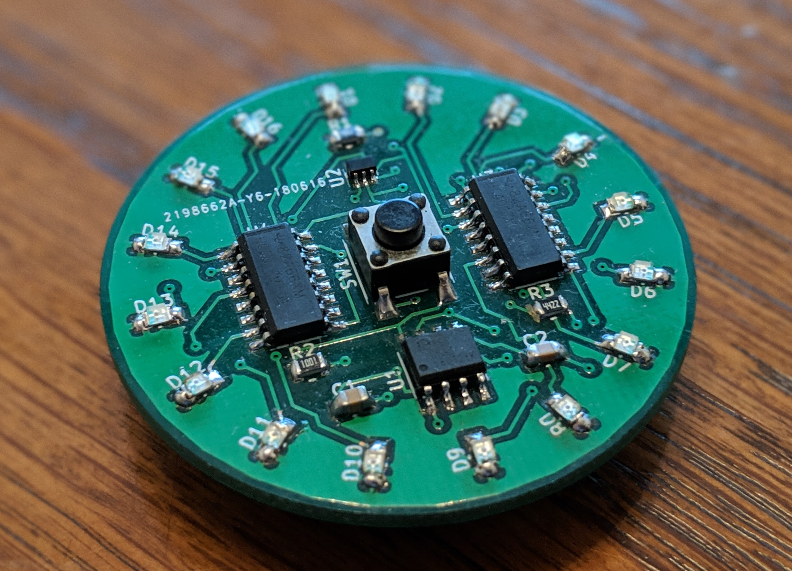
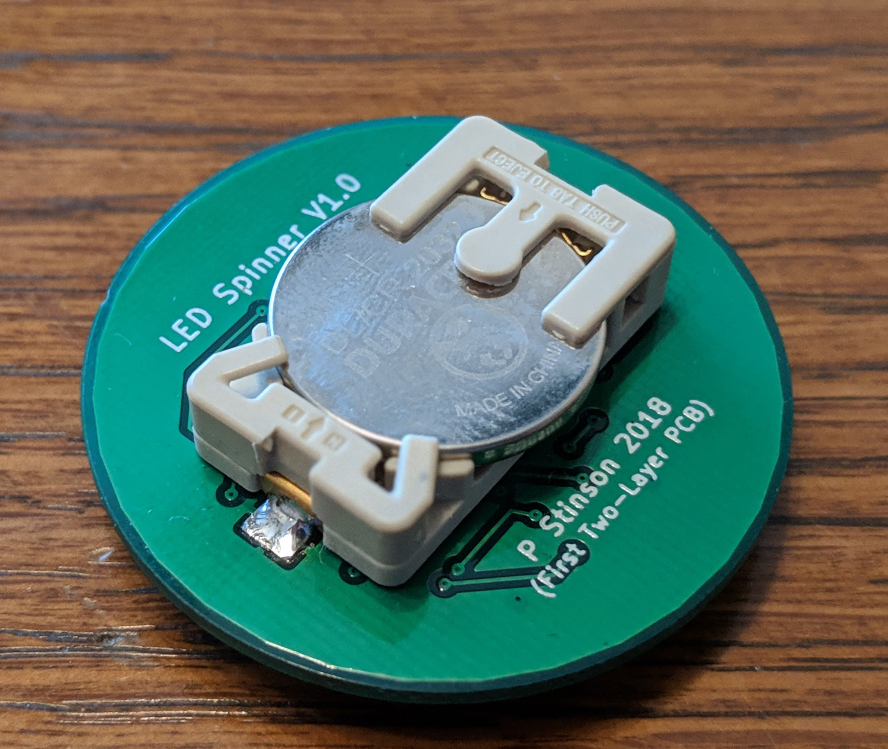

# led-spinner-pcb
My first two layer PCB, spinning LED effect with no micro-controller or code.

The circuit consists of two 4017 decade counters, connected together to create sixteen sequential outputs. The outputs progress on each clock cycle and loop back to the beginning when the end is reached. Each output is connected to an LED on the perimeter of the PCB. The clock input is connected to a 555 timer IC in an astable configuration. This generates a continous square wave, causing the progression of the outputs and the spinning effect. The momentary push button completes the circuit, so it is only powered when the button is held down.

[![CC BY-SA 4.0][cc-by-sa-image]][cc-by-sa]

[cc-by-sa]: http://creativecommons.org/licenses/by-sa/4.0/
[cc-by-sa-image]: https://licensebuttons.net/l/by-sa/4.0/88x31.png
[cc-by-sa-shield]: https://img.shields.io/badge/License-CC%20BY--SA%204.0-lightgrey.svg

This work is licensed under a [Creative Commons Attribution-ShareAlike 4.0 International License][cc-by-sa].
